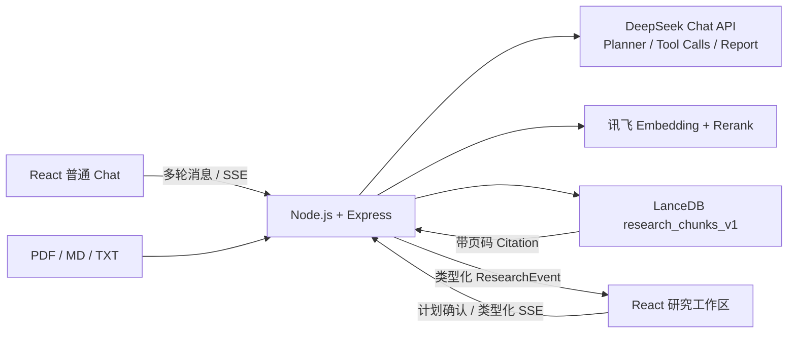

# InkMind — 对话与可观测知识研究 Agent

一个同时支持普通多轮对话与多文档知识研究的 AI 工作台。用户可在低门槛 Chat 模式中快速问答，也可以导入 PDF、Markdown 或 TXT，在 Research 模式中生成可编辑研究计划，通过 Agent 工具调用检索知识库，并流式生成带原文引用的结构化报告。

## 核心能力

- **双模式工作区**：普通 Chat 支持多会话、本地持久化、上下文对话、流式输出和停止生成；Research 聚焦私有知识研究，两种模式切换时保留各自状态。
- **服务端 Agent 编排**：DeepSeek 负责 Planner、原生 Function Calling、证据评估与报告生成，浏览器只消费类型化事件。
- **多阶段 RAG**：讯飞 Embedding → LanceDB Top-20 向量召回 → 讯飞 Rerank Top-5，精排失败自动降级。
- **可追溯引用**：每条证据保留文档、页码、chunk ID、向量分数和精排分数，可在前端查看原文。
- **可观测执行过程**：研究步骤、检索状态、Citation 和文本增量通过 SSE 实时同步。
- **Human-in-the-loop**：模型先生成 2–4 步计划，用户确认或编辑后才执行。
- **安全边界**：最多 6 次检索、一次补充检索轮次、90 秒超时、Zod 参数校验及主动中止。

## 架构



关键设计：生成模型、Embedding 和 Reranker 通过 Provider 接口解耦，业务逻辑不绑定单一供应商；旧的 256 维哈希向量表不会与新语义向量表混用。

## 快速开始

要求 Node.js 24+（PDF.js 6 的运行时要求）。

```bash
npm install
copy .env.example .env
```

在 `.env` 中填写：

```env
DEEPSEEK_API_KEY=你的 DeepSeek Key
DEEPSEEK_BASE_URL=https://api.deepseek.com
DEEPSEEK_MODEL=deepseek-v4-flash

XUNFEI_API_KEY=你的讯飞 Key
XUNFEI_BASE_URL=https://maas-api.cn-huabei-1.xf-yun.com/v2
XUNFEI_EMBEDDING_MODEL=控制台中的 Embedding 服务模型 ID
XUNFEI_RERANK_MODEL=控制台中的 Rerank 服务模型 ID

PORT=3001
```

分别启动后端和前端：

```bash
npm run server
npm run dev
```

浏览器打开 `http://localhost:5173`，可在“普通对话 / 知识研究”之间切换。普通对话记录保存在浏览器 localStorage 中且不会检索知识库；研究模式上传文档会调用真实 Embedding 并写入 `data/research-v1`，该目录和密钥均不会提交到 Git。

如果 3001 端口仍运行旧版 `node server.js`，请先在原终端按 `Ctrl+C` 停止，再执行新的 `npm run server`；新版 `/health` 会返回 `service: "knowledge-research-agent"`。

## API

| 方法 | 路径 | 用途 |
| --- | --- | --- |
| GET | `/health` | 服务与 Provider 配置状态 |
| POST | `/api/documents` | multipart 上传并建立索引，字段名为 `files` |
| GET | `/api/documents` | 获取文档与索引状态 |
| DELETE | `/api/documents/:id` | 删除文档及向量 |
| POST | `/api/research/plans` | 生成可编辑研究计划 |
| POST | `/api/research/runs` | 确认计划并启动 SSE 研究任务 |
| POST | `/api/research/runs/:runId/cancel` | 中止研究任务 |
| GET | `/api/knowledge/search?q=` | 只读检索与评测接口 |
| POST | `/api/chat` | 普通 DeepSeek 多轮流式对话接口，支持客户端中止 |

## ResearchEvent

每个事件都包含 `runId`、递增 `sequence` 和时间戳。前端按运行 ID 隔离，并用 sequence 排序去重。

```text
run.started → plan.confirmed → step.started
→ tool.started → citation.collected → tool.completed
→ step.completed → text.delta* → run.completed
```

失败路径为 `run.failed`，主动中止或超时为 `run.cancelled`。UI 不展示模型内部思维链，只呈现计划、工具输入摘要、结果和来源。

## 工程验证

```bash
npm run typecheck
npm run lint
npm test
npm run build
```

RAG 评测集位于 `evals/rag-cases.json`。导入匹配的评测资料并启动服务后运行：

```bash
npm run eval:rag
```

脚本输出 Recall@5、MRR 和 P95 检索延迟。简历中应只使用该脚本实际产生的指标，不使用未经复现的“100% 准确率”。

## 项目取舍

- 选择自研轻量 Planner–Executor–Evaluator，而不是为了框架名接入 LangGraph，便于在有限周期内讲清 Agent 循环和事件协议。
- 不实现多 Agent、MCP、联网搜索和账号系统，首版聚焦“导入资料 → 计划 → 多轮检索 → 引用报告”的完整业务闭环。
- 讯飞 Rerank 不可用时允许降级为向量排序；Embedding 未配置时拒绝建立伪语义索引并返回可恢复错误。
- 当前 Markdown 与高亮依赖仍使主包超过 500 KB，后续可通过懒加载进一步拆包。
